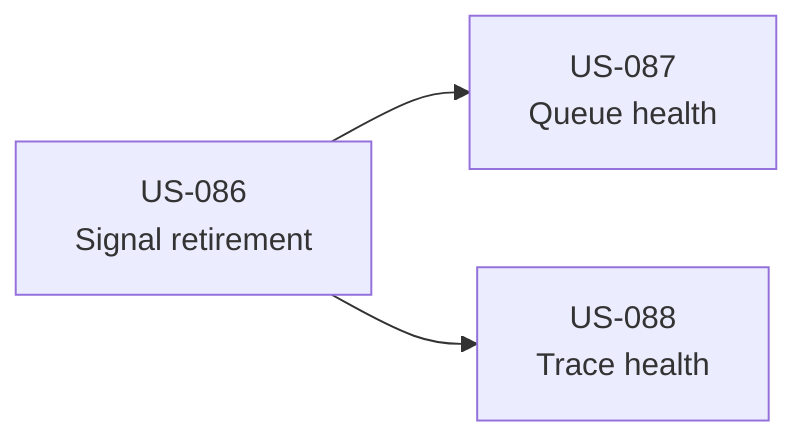

# E10 Harness Signal Quality

## Status

planned

## Intake

- Local intake: `#192`
- Type: `harness_improvement`
- Lane: `high-risk`
- Governing decision: `docs/decisions/0008-self-improving-harness-lifecycle.md`

## Goal

Make Harness retire obsolete or synthetic improvement signals without deleting
history, distinguish record integrity from improvement-flow health, and expose
lane-aware trace quality.

## Starting Evidence

- Audit reports `0/100` while eleven backlog items remain proposed.
- Synthetic Phase 5 smoke evidence created proposal/backlog items `#6` and `#7`.
- Validation-provider friction still generated a proposal after `US-072`
  registered the missing providers and all providers became present.
- Trace quality tiers are documented and individually scoreable, but there is
  no aggregate lane-aware health query.

## Stories

| Story | Lane | Outcome | Depends on |
| --- | --- | --- | --- |
| `US-086` Evidence Provenance And Causal Signal Retirement | high-risk | Classify evidence provenance and suppress resolved current-state evidence while preserving recurrence. | none |
| `US-087` Backlog Triage And Multidimensional Health | normal | Separate record integrity, improvement flow, signal quality, and queue age; provide read-only triage. | `US-086` |
| `US-088` Lane-Aware Trace Health | normal | Aggregate trace-tier compliance without penalizing legitimate historical or tiny traces. | `US-086` |

## Dependency Graph

## Non-Goals

- Delete or rewrite historical traces and interventions.
- Automatically accept, reject, or implement proposals.
- Change story verification or completion semantics.
- Implement the Symphony pre-run discussion surface.
