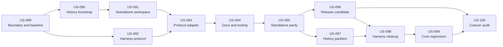

# E11 Symphony Repository Separation

## Status

implemented — `US-089` through `US-100` are implemented. Symphony is published
from its canonical `main` commit as `symphony-v0.1.1`, the cleaned Harness
release is published as `harness-cli-v0.1.15`, both released compatibility
smokes pass, the checksum-bound readiness and final gates pass, and explicit
proof-backed completion closed `US-100`.

## Intake And Decision

- Local discovery intake: `ink_e20b5387f9043c719faf0c3fc15946e3` (current
  local id `#193`; not present in the planning changeset and preserved through
  the pre-migration DB backup).
- Replayable planning intake linked to `US-089`:
  `ink_1a4efeff48a614a487467c6bb79cdfd9` (current local id `#194`; numeric ids
  may remap on rebuild).
- Type: `new_initiative`
- Epic lane: `high-risk`
- Governing decision:
  `docs/decisions/0009-separate-symphony-product-repository.md`
- Source baseline inspected: `repository-harness/develop@6e8243f2a5cb6a32cf0a7a0ecebdb257a429bdd9`
- Target inspected: empty `git@github.com:hoangnb24/symphony.git` and unborn
  local `main` at `/Users/themrb/Documents/personal/symphony`
- Inventory: `migration-manifest.md`

## Goal

Make Symphony a normally buildable, testable, releasable product in its own
repository while returning `repository-harness` to a reusable Harness template
whose CLI, installer, schemas, and operating model retain all generic behavior.

The final dependency direction is:

```text
Symphony release
  -> versioned Harness CLI protocol
  -> Harness-enabled target repository

repository-harness
  -/-> Symphony source, UI, release, tools, or durable work queue
```

## Why Copy, Prove, Then Remove

The target has no commits, while the source currently passes all known tests.
That creates a safe ordering:

1. Freeze the source SHA, ownership manifest, database backup, and green proof.
   This gives every later failure a known comparison point.
2. Filter the Symphony history into the empty target without changing the
   source. A failed import can be discarded without losing working code.
3. Make the target build and consume Harness through an explicit protocol.
   This removes sibling-workspace and raw-SQL assumptions while both copies
   still exist.
4. Run the target artifact against a clean Harness fixture created from a
   pinned Harness release. Passing only inside the old checkout is not
   standalone proof.
5. Partition operational history and local durable state. This stops the core
   matrix, backlog, tool registry, audit, and proposal loop from resurfacing
   Symphony work.
6. Remove Symphony from the source and run the complete Harness-only release
   and installer ladder.
7. Publish/merge the target first, merge source cleanup second, then run one
   end-to-end smoke across the released products.

If step 3 or 4 fails, steps 5 and 6 do not begin. The cause-and-effect is
deliberate: target parity failure leaves the current working product untouched.

## Product Boundary

| Owner | Owns | Must not own |
| --- | --- | --- |
| `repository-harness` | Agent shim and policies, templates, Harness CLI, schemas, installer, generic story/dependency/hierarchy and semantic-replay capabilities, CLI release workflow | Symphony runtime, Web UI, Electron shell, Symphony product docs, run/PR/sync state, vendored UI skills |
| `symphony` | Runner, worktrees, adapters, run artifacts, PR/sync orchestration, Web UI, Electron shell, product docs, compatibility tests, Symphony release artifacts | Harness CLI source, Harness schema fork, generic Harness installer or policy source |
| Versioned protocol | CLI discovery, CLI/version capability checks, JSON story/dependency/hierarchy reads, story mutations, changeset apply result, environment and artifact schemas | Source-path assumptions, human-output parsing, undocumented direct database mutation |

## Invariants

- `repository-harness` remains buildable and releasable after removing the
  Symphony workspace member.
- Symphony builds without `crates/harness-cli` or a sibling
  `repository-harness` checkout.
- All Harness writes made by Symphony go through `harness-cli`.
- No source removal occurs before a standalone target release candidate passes.
- No force-push, filter, reset, or history rewrite is performed in the original
  `repository-harness` checkout.
- Existing ignored worktrees and run artifacts are not deleted with a plain
  recursive removal. Git worktrees are inspected and pruned through Git.
- Legacy evidence is backed up and checksummed before active databases or
  changeset directories are replaced.
- Neither product repository tracks live operational `.harness/changesets`
  after cutover. Harness still ships the generic opt-in consumer tracking rule;
  Symphony deliberately keeps its operational logs local/archived and uses
  committed contracts/receipts as migration evidence.
- A fresh Harness install contains no unusable Symphony commands or links.
- Historical references may remain only in the allowlist defined by the
  migration manifest and ADR.

## Stories

| Story | Owner repository | Lane | Outcome | Depends on |
| --- | --- | --- | --- | --- |
| `US-089` Separation Boundary And Frozen Baselines | repository-harness | high-risk | Produce the exact path/record ownership manifest, source bundle/tag plan, and reproducible green baseline. | none |
| `US-090` Provenance-Preserving Symphony Bootstrap | symphony | high-risk | Import selected history from the frozen `develop` SHA into the empty target without touching source history. | `US-089` |
| `US-091` Standalone Symphony Workspace | symphony | normal | Create the one-member workspace, regenerated lockfile, independent metadata, and green source builds while preserving the crate layout. | `US-090` |
| `US-092` Machine-Readable Harness Orchestration Contract | repository-harness | high-risk | Publish additive JSON/versioned CLI operations needed by an external orchestrator without breaking existing CLI commands. | `US-089` |
| `US-093` Symphony Harness Protocol Adapter | both, coordinated (target primary) | high-risk | Establish target runnable ownership plus non-runnable source receipt proxies, consume the public protocol, remove raw Harness writes/prose parsing, and support configurable cross-platform CLI discovery. | `US-091`, `US-092` |
| `US-094` Symphony Product Docs And Optional Tooling Migration | symphony | normal | Make target docs, planning history, configuration examples, and tool guidance product-owned without vendored hidden tool trees. | `US-093` |
| `US-095` Cross-Repository Standalone Parity Suite | symphony | normal | Prove source, Web, desktop, prepare, execute, sync, and negative compatibility behavior against a clean pinned Harness fixture. | `US-094` |
| `US-096` Standalone Symphony Packaging And Release Candidate | symphony | normal | Build checksummed CLI/Web assets and desktop smoke artifacts that run outside both source checkouts. | `US-095` |
| `US-097` Durable History And Local State Partition | both, coordinated (source primary) | high-risk | Back up legacy evidence, replace live product changesets with synthetic core fixtures, reconcile target dispositions once, and reseed ownership-correct core state. | `US-095` |
| `US-098` Harness-Only Repository Cleanup | repository-harness | high-risk | Remove Symphony source/docs/tooling/workspace coupling and restore the template's active product and documentation surfaces. | `US-096`, `US-097` |
| `US-099` Harness Core Regression Closure | repository-harness | normal | Prove CLI, schemas, installer, release packaging, docs, and generic replay behavior after cleanup. | `US-098` |
| `US-100` Cutover And Post-Separation Audit | both, coordinated | high-risk | Publish/merge in safe order, verify canonical ownership, run a released cross-repo smoke, and close or execute rollback. | `US-096`, `US-099` |

## Dependency Graph



The critical path is:

```text
                 /-> US-090 -> US-091 -\
US-089 ---------<                      >-> US-093 -> US-094 -> US-095
                 \-> US-092 ----------/
                      -> (US-096 + US-097) -> US-098 -> US-099 -> US-100
```

`US-092` may run in parallel with `US-090` and `US-091`. The target then runs
`US-093`, `US-094`, and `US-095` in order. `US-096` and `US-097` may run in
parallel only after parity passes. If `US-097` activates its new core epoch
first, it must carry the non-runnable `changed` US-096 proxy and all of its
source edges forward; the later US-096 receipt completes that proxy and only
then can US-098/US-100 unblock.

## Durable Registration And Ownership Transfer

This planning pass registers all twelve stories and all fourteen final edges in the
current source database so the complete DAG is reviewable before the target has
a Harness database. That is transitional planning state, not permission for one
database to own both products forever.

- `US-089` and `US-090` run from the frozen migration procedure; `US-090`
  creates the target history before a target Harness can own work.
- At the start of high-risk `US-093`, install/init Harness in the target and
  first commit checksummed target-owned contract packets, then register
  target-owned stories `US-093` through `US-096` and their internal dependency
  chain there. Preserve completed `US-090` and `US-091` as migration evidence,
  not runnable target work.
- Hold a cross-DB migration fence. Stage target rows mechanically as
  `status=planned AND verify_command IS NULL`, with both automatic selection and
  direct run disabled. Convert the corresponding source rows to
  `status=changed` external-gate proxies, preserving every source dependency
  edge. Existing `changed` semantics—not a failing verify command—exclude them
  from automatic work selection and direct run; matrix retains them as visible
  coordination evidence, and the board must show Needs Attention, not Ready.
- After source automatic work selection proves zero, configure and negative-test the target
  verification wrapper and release the fence with exactly one runnable owner:
  the target. Physical duplicate rows are coordinated evidence, not duplicate
  runnable work.
- Target completion produces a checksummed, owner-attested receipt containing
  story ID, target repository/commit, protocol tag, validation run, completion
  time, and release tag/manifest when applicable. Only
  `scripts/verify-e11-external-gate.sh` may satisfy the matching source proxy's
  fail-closed verification, after which normal explicit completion moves it
  from `changed` to completed. The proxy is never retired, so source edges
  cannot disappear early.
- Keep `US-092`, `US-097` through `US-099`, and the source half of `US-100` in
  repository-harness.
- Cross-repository dependencies use these recorded receipt gates after the
  ownership transfer; a SQLite foreign key cannot span repositories. In
  particular, source `US-097` remains blocked by the source `US-095` proxy and
  source cleanup/cutover remain blocked by the `US-096` receipt.
- The transitional planning changeset
  `run_1783785600_e11_symphony_repository_separation_planning` is included in
  the `US-097` archive/epoch migration and does not remain an active template
  replay fixture.

## Story Activation Gate

The twelve durable rows intentionally have no `verify_command` while they are
plans. Audit `0/100` currently means only that the existing audit checks detect
no durable-state drift; it does not compare the Markdown table, Mermaid graph,
replayed edge set, or acceptance logic, and it is not implementation proof.

Before any E11 story becomes runnable or leaves `planned`:

1. Replace every `<placeholder>` in that story's command list with a real
   script, artifact, tag, or environment contract.
2. Convert negative checks to fail-closed shell logic; a clean `rg` exit `1`
   must not be mistaken for a failed validation, and a non-empty `git ls-files`
   result must fail explicitly.
3. Configure one story-level wrapper with
   `harness-cli story update --id <id> --verify <command>`.
4. Prove the wrapper fails against a deliberately unmet fixture where safe,
   then run it after implementation and retain the passing evidence.
5. Do not mark implementation complete through proof flags alone; use the
   normal explicit completion/review rules after all dependency gates pass.

For the US-093 ownership fence specifically, “staged” has no invented status:
it means exactly `status=planned AND verify_command IS NULL` while both
automatic selection and direct `run` enforce the migration fence. Tests must
show target work selection returns zero and direct prepare is rejected; source
selection must also return zero after its rows become non-runnable proxies and
before the target verifier is activated.

## Repository Gates

### Gate A — Frozen Source

- Both working trees are clean.
- The source SHA and branch are recorded; `develop`, not the older `main`, is
  used unless the missing 18 commits are intentionally resolved first.
- The source bundle/tag and database backup are readable and checksummed.
- Every tracked path and active durable row has one ownership action.
- Baseline proof passes.

### Gate B — Independent Target

- Target Cargo metadata names only `harness-symphony`.
- Target `Cargo.lock` contains no `harness-cli` package.
- No manifest, script, or test uses a sibling source checkout.
- Target source, UI, browser, and desktop checks pass.

### Gate C — Public Runtime Contract

- Symphony discovers `harness-cli` through configuration, target-local
  macOS/Linux or Windows paths, then `PATH`.
- Compatibility failure is detected before mutation.
- All writes go through typed CLI operations.
- Machine consumers parse JSON, never terminal prose.
- Work selection reads one transactionally consistent graph revision; isolated
  worktree DBs come from the WAL-safe snapshot protocol, never a file copy.
- Story retirement is compare-and-set/runnable-checked, and changeset apply
  validates header/base schema plus content SHA before mutation.
- CLI `0.1.11` plus schema `12` is the pre-separation behavioral baseline, not
  the positive protocol-v1 support floor. Positive standalone support is pinned
  to the exact Harness CLI release produced by `US-092` (expected to be newer
  than `0.1.11`), schema at least `12`, changeset header `1`, Symphony config
  `1`, run contract `1`, and result contract `1`. CLI `0.1.11` is retained as a
  negative fixture that must fail with an actionable upgrade before mutation.

### Gate D — Standalone Parity

- A released-style Symphony artifact runs from a third temporary directory.
- Its `--repo-root` points to a clean Harness fixture made from a pinned
  Harness release, not either source checkout.
- Doctor, work list, prepare, deterministic execution, Web health/board,
  changeset apply, sync idempotency, and desktop smoke pass.
- Old/missing Harness or a missing required protocol capability hard-fails
  before state mutation. A selected execution agent that is missing fails run
  setup before execution. An unregistered/absent optional provider is a clean
  skip; a registered-but-missing optional provider is a degraded warning with
  weak-proof reporting, not a standalone startup failure.

### Gate E — Safe Removal

- Symphony target release candidate and provenance commit are recorded.
- Legacy DB, changesets, worktree list, and run artifacts are backed up.
- Core synthetic replay fixtures pass before active product changesets leave.
- Source cleanup is reviewable as a separate commit/PR.

### Gate F — Cutover

- Target is merged/published before source cleanup is merged.
- Cleaned Harness CLI and installer release checks pass.
- One released Symphony artifact operates against the cleaned Harness install.
- Core matrix, backlog, tools, audit, and proposals contain no active Symphony
  work.

## Epic Exit Criteria

- `hoangnb24/symphony` is the documented canonical source and has preserved
  provenance back to the frozen repository-harness SHA.
- A clean clone of Symphony builds and passes Rust, Web UI, Playwright, and
  desktop smoke without repository-harness source.
- A packaged Symphony binary serves its Web UI and operates on a separately
  installed Harness fixture.
- `repository-harness` has one workspace member: `harness-cli`.
- `git ls-files` in repository-harness contains no active
  `crates/harness-symphony`, Symphony product docs/stories, `.agents`, `.codex`,
  `.impeccable`, or live `.harness/changesets` files. The generic consumer
  `.gitignore` exception/template rule that permits a Harness-enabled consumer
  to commit its own changesets remains tested.
- `git ls-files` in Symphony contains no imported monorepo or live operational
  `.harness/changesets`; any temporary migration-run files are hashed/archived
  and removed from the active checkout before cutover.
- Harness keeps and tests isolated DB selection, semantic changesets,
  apply/rebuild, dependencies, hierarchy, explicit completion, and validation
  quarantine as generic capabilities.
- A fresh Harness install has no dangling Symphony links, UI ignores, Web
  tooling, or Symphony commands.
- Core durable state contains only Harness-owned active work and providers;
  Symphony-owned active work exists only in the Symphony product context.
- Historical references are restricted to the ADR, this completed epic,
  changelog/PR history, and an explicit archive/provenance note.
- Rollback artifacts are retained through final cutover verification and normal
  release-retention policy.

## Epic Validation

Current source baseline, captured on 2026-07-11:

```text
cargo test --workspace                       73 CLI + 99 Symphony tests passed
npm ... run build                            passed
npm ... run e2e                              19 Playwright tests passed
npm ... run desktop:smoke                    passed
cargo fmt --check                            passed
cargo clippy --workspace -- -D warnings      passed
scripts/validate-changeset-rebuild.sh        restored 59 rows and passed
```

Final Harness-only gate:

```bash
cargo metadata --locked --no-deps --format-version 1
cargo fmt --check
cargo clippy -p harness-cli --all-targets -- -D warnings
cargo test -p harness-cli --locked
scripts/validate-changeset-rebuild.sh
scripts/test-validate-changeset-rebuild.sh
bash -n scripts/install-harness.sh
bash -n scripts/build-harness-cli-release.sh
scripts/bin/harness-cli audit
git diff --check
```

Final Symphony gate is specified in `US-095` and `US-096`.

## Rollback Model

- Before Gate D: discard or repair only the target branch; source remains the
  working authority.
- Between Gate D and source cleanup: target may be rebuilt from the recorded
  filter map and source bundle.
- After source cleanup but before final cutover: revert the cleanup PR or build
  from the annotated pre-extraction tag; do not rewrite shared history.
- After cutover: roll Symphony back to the last passing release and keep Harness
  on the cleaned core unless the public protocol itself is proven incompatible.
- Any rollback restores backed-up local databases by file replacement only
  after both processes are stopped and checksums are rechecked.

## Non-Goals

- Flatten the preserved `crates/harness-symphony` layout during extraction.
- Redesign the Symphony UI or workflow.
- Move or fork Harness CLI source into Symphony.
- Delete Git history, old PR metadata, or the source bundle.
- Publish a hosted multi-user Symphony service.
- Add desktop signing, notarization, or auto-update before the standalone CLI
  release is proven.
- Start any story automatically from this planning pass.
